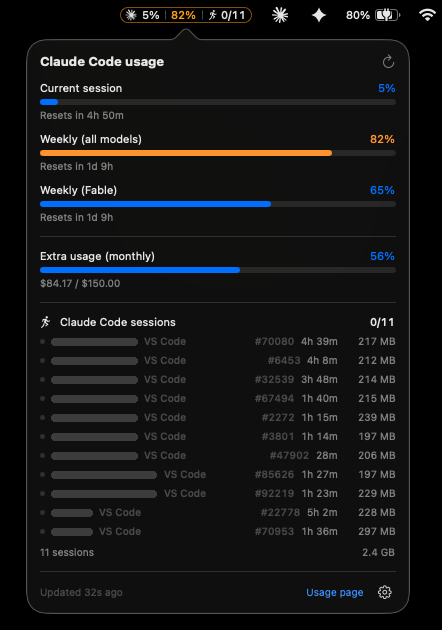
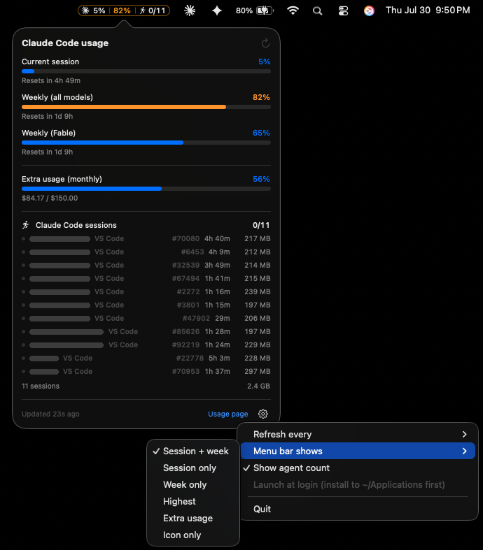

# Claude Usage (macOS menu bar)

Menu bar app that shows your Claude Code usage the same way `claude.ai/settings/usage`
does: 5-hour session limit, weekly limits (all models and per-model), monthly extra-usage
credits, plus how many Claude Code agents are running on this machine.

No dependencies, no Xcode project, no telemetry: ~1,800 lines of Swift that build into a
1.2 MB universal app with one `swiftc` invocation. macOS 13+, Apple Silicon and Intel.


```
✳  (95%) (81%) (🏃3/13)
│     │     │      └── Claude Code sessions: 3 of the 13 open are actually working
│     │     └───────── weekly limit used
│     └─────────────── current 5-hour session used
└───────────────────── the Claude mark, so you can find it among the other icons
```

"Working" means burning CPU right now, not merely open. A session parked at the prompt
since this morning holds as much memory as one streaming tokens, so counting them together
made the number mean very little on a machine with a dozen tabs open. The count reads `3/13`
while some are idle and collapses to a bare `13` when they are all busy, since `13/13` uses
menu bar width to say nothing.

Each value sits in its own rounded chip, which is why the whole status item is drawn as a
single image: an `attributedTitle` can only give a value a square background, not a
border. Chips stay monochrome and follow the menu bar's light/dark tint like any system
icon until a limit gets tight, then turn orange above 75% and red above 90%. When the API
sends its own `severity`, the worse of the two wins: it can escalate a limit early, but it
cannot paint a chip at 95% green. A red `!` chip appears when a refresh is failing, so
cached numbers are never presented as current.

Clicking the icon opens a panel with a bar per limit, the reset countdown, the monthly
extra-usage spend, and the list of running sessions (folder, host, pid, uptime, memory).
Sessions are grouped by folder, and inside a folder the longest-running one comes first.
A filled dot and a brighter folder name mark the ones that are working; the rest are open
but idle. The footer adds up what all of them are holding, which is the number that
answers "why is this machine slow" - a dozen sessions is comfortably a couple of
gigabytes, and the memory a session holds does not drop when it goes idle.

The memory column is the same number Activity Monitor shows in its "Memory" column
(`phys_footprint`), not the larger resident-size figure `ps` prints, so the two agree.

Sessions started from the **Claude desktop app** are listed too, as one row reading
"Desktop session / Claude app". They run inside a virtual machine rather than as a process
on your Mac, so there is no folder to show and the whole guest counts as a single entry,
however many conversations are open inside it. Its memory is the VM's, which is a larger
number than a CLI session's for the same reason. Quit the app and the row goes away.



(The grey bars in the screenshots are folder names painted over, not a state the app has.)

The session list has nothing to do with the usage refresh interval. Reading it is a local
walk of the process table, so nothing rate limits it and it runs on its own cycle: every
ten seconds while the panel is open, every thirty while only the menu bar count is
showing, not at all while nothing is displaying it, and immediately the moment either one
comes back (so the list is never stale on arrival). A session you close leaves the
panel while you watch it happen, whether the usage numbers are set to refresh once a
minute or once every fifteen.

What shows next to the icon is configurable from the gear menu: session only, week only,
credits, whichever is highest, both (the default), or nothing but the mark.



## Build and install

```bash
make            # lists every target (same as `make help`)
make build      # builds build/ClaudeUsage.app
make install    # builds, installs to ~/Applications and launches it
make test       # runs the logic tests (~1s)
```

Every target:

| Target | What it does |
| --- | --- |
| `make` / `make help` | lists the targets; the default goal, so a bare `make` never compiles by surprise |
| `make build` | compiles `build/ClaudeUsage.app`, universal (`arm64` + `x86_64`), ad-hoc signed |
| `make test` | compiles and runs the logic tests, no app bundle and no XCTest |
| `make install` | builds, copies to `~/Applications`, then launches it |
| `make run` | builds, quits any running copy and launches the one in `build/` |
| `make stop` | quits a running ClaudeUsage |
| `make zip` | builds `build/ClaudeUsage.zip`, a shareable archive (see below) |
| `make clean` | removes `build/` |
| `make uninstall` | quits the app and removes the copy in `~/Applications` |

`make build` only recompiles when a file under `Sources/` or `Resources/`, or `build.sh`
itself, is newer than the built app; otherwise it says so and exits. `make clean build`
forces a full rebuild.

The Makefile is a wrapper: `./build.sh` and `./build.sh install` still work the same.

Requires the Xcode command line tools (`swiftc`). No third-party dependencies, no Xcode
project. macOS 13+, universal (`arm64` + `x86_64`).

The first launch shows a keychain prompt ("security wants to use your confidential
information") because the app reads the Claude Code OAuth token. Choose **Always Allow**.

Enable **Launch at login** from the gear menu in the panel. It is only offered once the
app lives in `/Applications` or `~/Applications`: macOS remembers the path the login item
was registered from, so enabling it while running out of `build/` would break the moment
you ran `make clean`.

## Sharing a build

`make zip` produces `build/ClaudeUsage.zip` (universal, ~360 KB). The app is **ad-hoc
signed**, not notarized, so on another Mac macOS quarantines it after download. The
receiver unzips it, moves it to `/Applications` and runs:

```bash
xattr -dr com.apple.quarantine /Applications/ClaudeUsage.app
```

Building from source with `make install` avoids that entirely, since nothing gets a
quarantine flag.

## Where the data comes from

| Panel section | Source |
| --- | --- |
| Session / weekly limits, extra usage | `GET https://api.anthropic.com/api/oauth/usage` with the Claude Code OAuth token |
| Active agents | local process table, read through `libproc` (no subprocesses) |

The token is read at request time from the login keychain item `Claude Code-credentials`
(falling back to `~/.claude/.credentials.json`), the same one the `claude` CLI uses. It is
never written to disk or logged by this app. When it expires, the panel asks you to open
Claude Code, which refreshes it; the app then picks up the new token automatically.

## Refresh rate

The usage endpoint is rate limited per 5-minute window and answers `429` with a
`Retry-After` header when you poll it too often, so:

- usage refreshes every 5 minutes by default (30s / 1m / 5m / 15m in the gear menu, with a
  hard 25s floor and backoff that honors `Retry-After`, in seconds or as an HTTP date). The
  floor covers the panel's refresh button too, which is greyed out until a request would
  actually go out rather than swallowing the click: hammering it is otherwise the quickest
  way into the 5-minute window, and retrying inside that window keeps it open;
- the agent count is on a separate loop with no connection to the interval above: every ten
  seconds while the panel is open, every thirty while only the menu bar chip shows it, and
  not at all while nothing does - the loop stops rather than idles, and restarts with an
  immediate scan, so the list is never stale on arrival. It reads the process table through
  `libproc`, so no server has an opinion about it and it costs ~3ms of CPU per scan, or
  about a second per hour at the slower rate. It used to fork `ps` and one `lsof` per
  agent, which was ten times that and was the app's entire CPU footprint;
- the reset countdowns tick once a second only while the panel is open, and the menu bar
  image is only redrawn when a value actually changes;
- while the app is backing off, the footer says so in orange with the time left, instead
  of a grey "updated 6m ago" that looks like nothing is wrong;
- the last successful response is cached, so a restart shows the previous numbers with
  their age instead of an empty panel (the 25s floor is measured against this session's
  own requests, so a relaunch always fetches immediately).

## Project layout

```
Sources/
  App.swift            NSStatusItem + popover wiring (menu bar only, LSUIElement)
  UsageModel.swift     polling, keychain token, backoff, menu bar title
  AgentsMonitor.swift  counts running Claude Code processes
  UsageView.swift      SwiftUI panel
  StatusIcon.swift     draws the status item: the mark and the value chips
  Models.swift         API types, derived rows, formatting
Resources/
  claude-mark.png      the menu bar mark, copied into the .app at build time
Tests/
  main.swift           292 logic checks, `make test`
docs/                  the screenshots on this page (folder names painted over)
build.sh               compiles both arches, lipos, bundles and ad-hoc signs the .app
Makefile               build / test / install / run / zip / clean / uninstall
```

`make test` compiles every source except `App.swift` together with `Tests/main.swift` into
a plain command line binary and runs it: 292 checks in about a second. No XCTest and no
test target, for the same reason there is no Xcode project.

It covers the parts that are easy to get quietly wrong: which processes count as an agent
and how they are sorted, how the desktop app's virtual machine is told apart from any other
one on the system, the severity thresholds, date and money formatting, the rows
derived from the API response, how the decoder degrades when the response changes shape,
the menu bar chips in every display mode, the whole 429 backoff (doubling, ceiling,
`Retry-After` as a lower bound, the floor between requests), the status image's template
rule and its VoiceOver description, the credentials parser, and the login-item eligibility
check. What is left out is what needs a live socket, the real process table or a running
status item.

## Caveats

`GET /api/oauth/usage` is an undocumented internal endpoint (the one behind `/usage` in
the Claude Code UI). Field names can change without notice, so the decoder degrades field
by field: a value of the wrong type costs that field, one unreadable entry in `limits`
costs its own bar, and `limits` disappearing entirely falls back to the older
`five_hour` / `seven_day` shape. Whatever still parses is still drawn. It is also rate
limited: polling faster than the 25s floor earns a `429`, which the app backs off from.

Its `is_active` flag is **not** used to decide which limits to show. Against a live
account it comes back `false` on limits that plainly exist (a running session, the weekly
per-model limit) and `true` on exactly one entry, the one currently binding, so treating
it as "the account has this limit" hid real bars. Limits you do not have are simply absent
from the response.

## License

MIT, see [LICENSE](LICENSE), which covers the code.

Unofficial and not affiliated with Anthropic. `Resources/claude-mark.png` is the Claude
mark taken from [lobe-icons](https://github.com/lobehub/lobe-icons) (MIT), and the logo
itself remains Anthropic's trademark: the MIT license on this repo does not grant any
rights over it. Swap that PNG for anything else and the app keeps working, the file is
loaded by name and nothing else depends on it.
